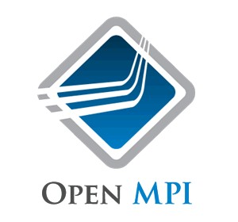

#MPI-SACA

This package is a library based on Ansible scripting and Vagrant to deploy CLOUD-SACA an MPI-Cluster based package on multiple service providers for more information about, check out this link [CLOUD-SACA](http://www.nubios.nileu.edu.eg/tools/MainPage.html?tool=cloudSACA)

**System Requirements**

Please check out the minimum requirments 

- CPU: 2 cores
- Memory: 4 GB
- Disk: 20 GB
- OS: Linux
- Distribution: Ubuntu 12.04 LTS

**Install Virtualbox on Ubuntu 12.04 LTS**

Install virtualbox using apt-get:
 
     $ sudo apt-get install virtualbox

or download virtualbox that satisfy your operating system from [here](https://www.virtualbox.org/wiki/Linux_Downloads)

**Install Vagrant on Ubuntu distribution:**

     $ sudo apt-get install vagrant

  **RECOMMENDED**

  but I suggest to install Vagrant Binary from [here](http://www.vagrantup.com/downloads.html)

by default virtualbox is the main hypervisor for vagrant, so we do not need any plugins to use virtualbox

**Install Vagrant Azure Plugin**

Azure provides a vagrant plugin used which interfaces with it's API

     $ vagrant plugin install vagrant-azure

also import this dummy azure vagrant box
  
     $ vagrant box add azure https://github.com/msopentech/vagrant-azure/raw/master/dummy.box

**Install Vagrant Google Client Plugin**

I am using standard Vagrant 1.1 plugin installation mode, try the following command line to install google plugin 

     $ vagrant plugin install vagrant-google

also you have to import google box to vagrant to be able to create vm on GCE (Google Compute Engine)

     $  vagrant box add gce https://github.com/mitchellh/vagrant-google/raw/master/google.box

**Install Vagrant AWS Plugin**

Install vagrant plugin for aws and import aws vagrant box

     $ vagrant plugin install vagrant-aws
     $ vagrant box add dummy https://github.com/mitchellh/vagrant-aws/raw/master/dummy.box

